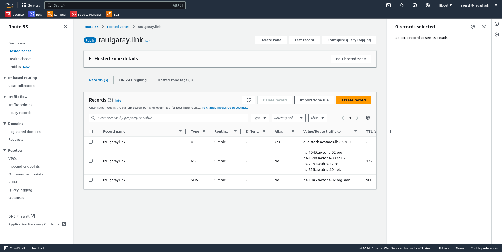
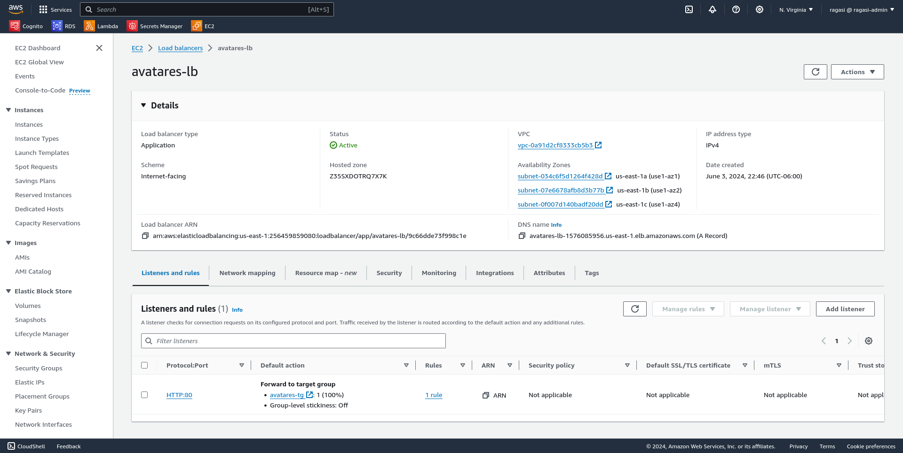
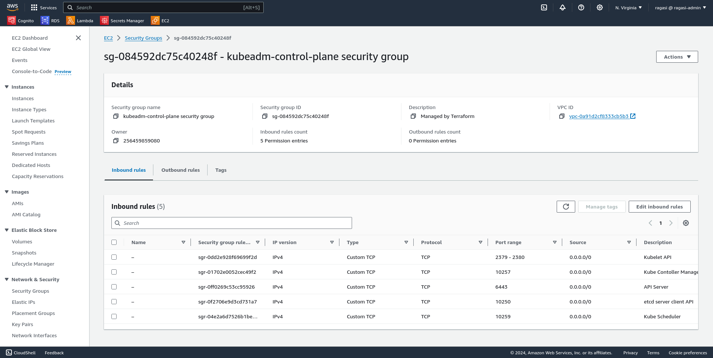
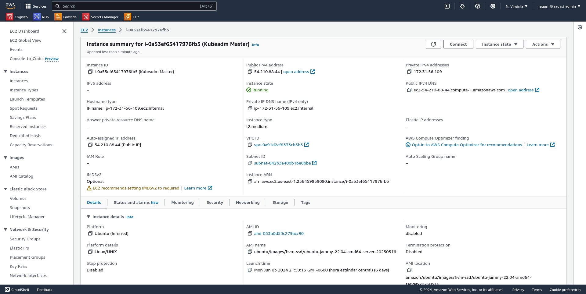

## Proyecto Final de Bootcamp DevOps: Avatares 🚀

### Descripción del Proyecto:
Avatares es un proyecto de muestra diseñado para demostrar el uso de contenedores en un entorno DevOps. Consiste en un backend de API web en Python 3.10 para generar avatares y un frontend de SPA (aplicación de página única) en Node.js 18. El objetivo de este proyecto es aplicar prácticas y herramientas de DevOps para mejorar la calidad, rendimiento, seguridad y eficiencia operativa de la aplicación.


Más Información: [Enlace](./ABOUT.md)

#### Componentes del Proyecto:
1. **Backend de API (Python 3.10):**
   - El backend de la API está desarrollado en Python 3.10 utilizando un framework web como Flask.
   - carpeta /api
   - Codigo principal app.py
   - Requiere dos variables de entorno
   ```
   FLASK_APP=app.py
   FLASK_ENV=development
   ```
   - La API proporciona endpoints para generar avatares basados en diferentes parámetros de entrada.
   - Metodos GET:
   ```
   /api/avatar
   /api/avatar/spec
   /ready
   ```

2. **Frontend SPA (Node.js 18):**
   - El frontend es una aplicación de página única (SPA) desarrollada en Node.js 18 utilizando un framework como React+vite.
   - Carpeta web/
   - Requiere dos variables de entorno
    ```
    VITE_HOST=0.0.0.0
    VITE_PORT=5173
    ```
   - Usar el gestor de paquetes npm
   - El frontend se comunica con el backend a través de solicitudes HTTP para generar y mostrar avatares.

#### Objetivos DevOps:
El objetivo principal es implementar un flujo de trabajo DevOps completo para el proyecto Avatares. Esto incluye:

1. **Infraestructura como Código (IaC) con Terraform:**
   - Utilizar Terraform para definir y aprovisionar la infraestructura necesaria, como servidores, cluster, redes, bases de datos, etc.
   - Usar AWS ó Localstack

2. **Continuous Integration / Continuous Deployment (CI/CD):**
   - Configurar un pipeline de CI/CD utilizando herramientas como Jenkins, GitLab CI, o GitHub Actions.
   - Implementar despliegues automatizados del backend y frontend en entornos de desarrollo y producción.

3. **Contenedores:**
   - Utilizar contenedores Docker para empaquetar y distribuir la aplicación backend y frontend, junto con todas sus dependencias.
   - Definir Dockerfiles para construir imágenes de contenedor optimizadas y seguras.
   - Utilizar Docker Compose para orquestar contenedores en entornos locales de desarrollo y pruebas.
   - Subir las imagenes al Registry de Docker-Hub

4. **Orquestación de Contenedores con Kubernetes:**
   - Implementar Kubernetes para orquestar y administrar los contenedores en un entorno de producción.
   - Definir y desplegar manifestos de Kubernetes (archivos YAML) para desplegar y escalar la aplicación en clústeres de Kubernetes.
   - Pueden usar Minikube/k3s/K0s/Killercoda/AWS-EKS

5. **Observabilidad:**
   - Implementar herramientas de observabilidad como Prometheus para la recopilación de métricas, Grafana para la visualización de métricas.
   - Configurar paneles de control en Grafana para monitorear el rendimiento de la aplicación, la utilización de recursos y la salud del clúster de Kubernetes.

6. **Buenas Prácticas:**
   - Aplicar prácticas de seguridad.
   - Implementar estrategias de gestión de configuración para mantener la configuración de la aplicación separada del código fuente.
   - Utilizar GitFlow para gestionar el flujo de código y versionado de la aplicación.

#### Entregables del Proyecto:
- Repositorio de código en un sistema de control de versiones como GitHub, GitLab o Bitbucket.
- Documentación detallada que describa la arquitectura del proyecto, la configuración de la infraestructura, los pasos de implementación de DevOps y las prácticas seguidas.
- Pipeline de CI/CD configurado y funcionando para el despliegues.
- Infraestructura aprovisionada y administrada mediante Terraform.
- Aplicación desplegada y ejecutándose correctamente en un clúster de Kubernetes.
- Herramientas de observabilidad configuradas y proporcionando información útil sobre el estado y rendimiento de la aplicación.


## Recursos creados en AWS para levantar el proyecto

### Hosted zone



### LoadBalancer



### Security groups

#### Master Node


#### Worker Node


#### Common nodes


### Instancias del cluster

#### Master Node


#### Worker Node


## Aplicación en ejecución


